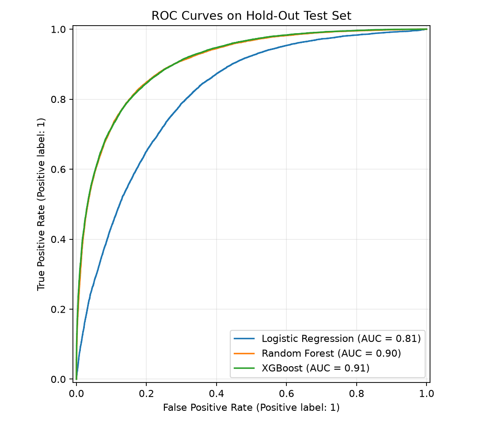
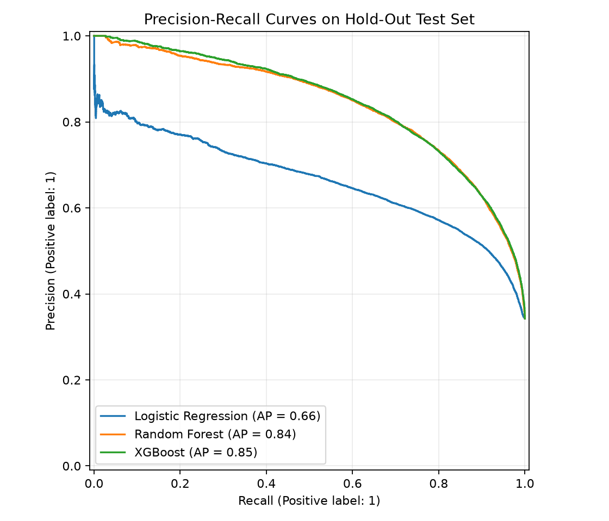
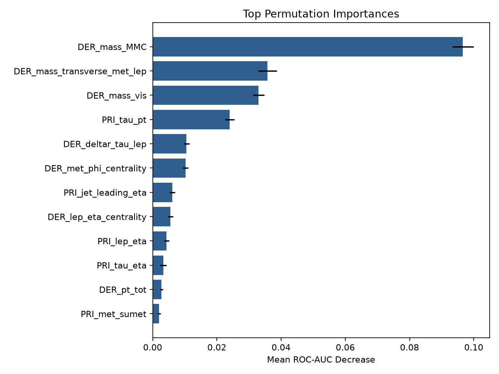
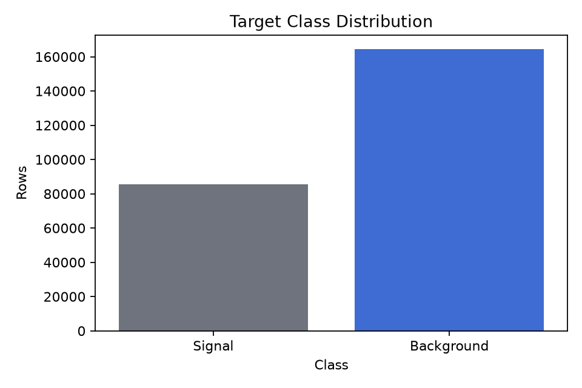

# HiggsBoson

A reproducible machine learning assignment for the Kaggle Higgs Boson Machine Learning Challenge. The project trains and compares logistic regression, random forest, and XGBoost models to classify simulated particle collision events as Higgs signal (`s`) or background (`b`).

[View the GitHub Pages site](https://frankstop.github.io/HiggsBoson/) · [Download the Kaggle data](https://www.kaggle.com/competitions/higgs-boson/data) · [Open the notebook](Higgs_Boson_Classification_Pipeline.ipynb)

## What this project does

The assignment turns the original Higgs challenge dataset into a full supervised classification workflow:

- Loads the Kaggle `training.csv` file with 250,000 rows and 30 model features.
- Drops identifier and event-weight columns from the predictor matrix.
- Converts the Higgs `-999` sentinel values into missing values.
- Uses median imputation and numeric scaling inside the modeling pipeline.
- Applies random oversampling inside training folds because signal events are the minority class.
- Compares logistic regression, random forest, and XGBoost.
- Uses hold-out metrics, stratified cross-validation, grid search tuning, and permutation importance.

## Current results

| Model | Precision | Recall | F1 score | ROC-AUC |
| --- | ---: | ---: | ---: | ---: |
| Tuned XGBoost | 0.7160 | 0.8260 | 0.7671 | 0.9093 |
| XGBoost baseline | 0.7078 | 0.8257 | 0.7622 | 0.9063 |
| Random Forest | 0.7654 | 0.7580 | 0.7617 | 0.9049 |
| Logistic Regression | 0.5884 | 0.7600 | 0.6633 | 0.8133 |

The strongest baseline model was XGBoost. After grid search, tuned XGBoost reached a hold-out ROC-AUC of `0.9093`.

## Screenshots

### ROC curves



### Precision-recall curves



### Top permutation-importance features



### Target distribution



## Data source

The real training data is not committed to this repo. Download it from Kaggle:

- Data page: <https://www.kaggle.com/competitions/higgs-boson/data>
- Kaggle CLI command:

```bash
kaggle competitions download -c higgs-boson -f training.csv.zip -p data
unzip data/training.csv.zip -d data
```

After download, the expected file path is:

```text
data/training.csv
```

`data/training.csv` is listed in `.gitignore` so the local dataset does not get pushed to GitHub.

## Run locally

Create a virtual environment and install dependencies:

```bash
python3 -m venv .venv
.venv/bin/python -m pip install -r requirements.txt
```

Run the full real-data pipeline:

```bash
.venv/bin/python src/higgs_pipeline.py --data data/training.csv --output-dir outputs/real --cv-folds 3 --n-jobs 1
```

Run a quick smoke test without Kaggle data:

```bash
.venv/bin/python src/higgs_pipeline.py --demo --output-dir outputs/demo
```

## Generated outputs

The pipeline writes these review artifacts under `outputs/real`:

- `metrics_baseline.csv`
- `metrics_tuned.csv`
- `cross_validation.csv`
- `best_model_grid_search.json`
- `top_features.csv`
- `summary.md`
- `target_distribution.png`
- `roc_curves.png`
- `precision_recall_curves.png`
- `top_features.png`

## Repository structure

```text
.
├── index.html
├── assets/
│   └── styles.css
├── data/
│   └── .gitkeep
├── outputs/
│   └── real/
├── src/
│   └── higgs_pipeline.py
├── Higgs_Boson_Classification_Pipeline.ipynb
├── requirements.txt
└── README.md
```

## GitHub Pages

This repo is set up as a static GitHub Pages site. The entry point is `index.html`, and the generated plots are served directly from `outputs/real`.
